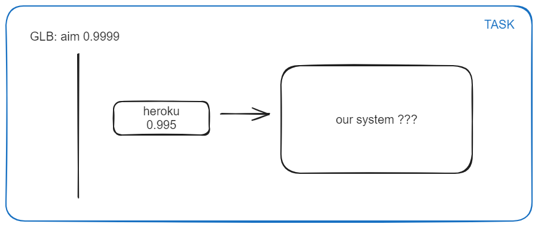
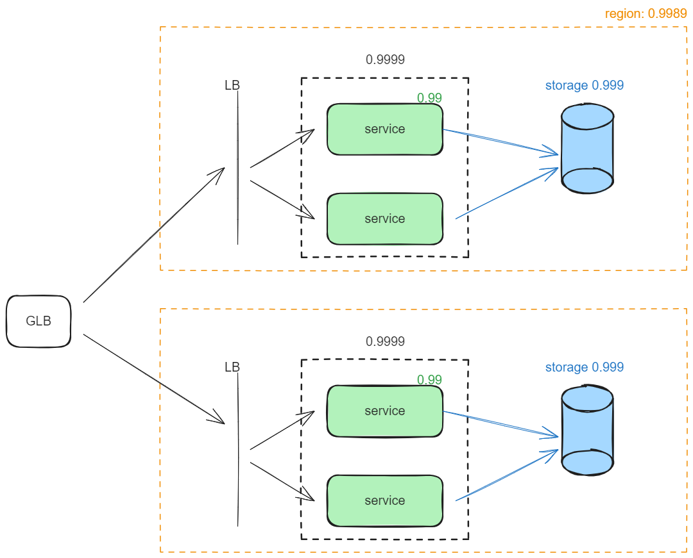

ok, we have A(heroky) = 0.995, any Availability of our system and requirements to have 4nines.

1 heroku installation cannot produce the required value, so lets count value of availability our system with several heroku region deploy.

`A_app` - availability of our app/our system.  
`A_heroku_app` - availability of heroku claster.

```
A(system) = 1 - UA(system) = 0.9999; // Availability of system
UA(system) = 0.0001 = (1-A_heroku_app) _ (1-A_heroku_app) _ ...;
```

if we use 2 parallel heroku:

```
1-A_heroku_app = 0.01;
A_heroku_app = 0.99 = 0.995 * A_app;
```

so availability of our system should be

```
A_app = 0.9949 ~ 0.995; // the same as heroku
```

if we use 3 parallel heroku, A_app ~ 0.96

At this point we can choose between total cost of heroku claster vs increase availability of our app (from 0.96 to 0.995).

Lets make some assumptions:

- Our _system_ hide internal architecture
- `A_storage` - availabilty of storage with replication `=0.995`.
- `A_service` - availability of service that make all work `=0.99`.

so availability of our app:

```
A_app = 0.999*0.99 = 0.985 < 0.995
```

using unavailability formula we got that we should duplicate _service_:



More calculations:

```
A_region = 0.9999*0.995 = 0.9949;
A_app = 0,99997399
```
